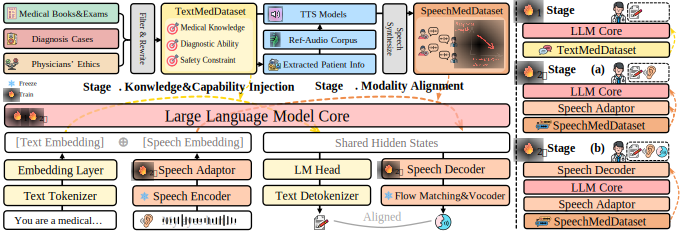

# SpeechMedAssist: Efficiently and Effectively Adapting Speech Language Model for Medical Consultation

SpeechMedAssist is a SpeechLM designed for speech-based multi-turn medical consultation, which can natively analyze symptoms, conduct proactive inquiries, and provide diagnostic and treatment suggestions.




## DEMO for comparison among different models
**👉 You can download this repository and open [`index.html`](./demo_package/index.html) in your local browser to view the demo.**

**👉 One Sample Response from SpeechMedAssist**
- **SpeechMedAssist2 Text Response:**
> 处理方式要看具体情况，可能是药物治疗或者再次清宫。关键是早发现早治疗，避免感染和其他并发症。记得保持个人卫生，避免性生活直到医生说可以。

- **SpeechMedAssist2 Audio Response:**
> [**🔊click to play**](https://github.com/user-attachments/assets/aa7a38e9-14d1-4fab-ae18-391514076849)


## 0.Environment

To run our model, the following steps are required:
```shell
conda create -n SpeechMedAssist python=3.10
pip install -r requirements.txt
```

To run all baselines in [[inference]](./inference), some functions in the original projects are needed. The following steps are required:
```shell
git clone https://github.com/zai-org/GLM-4-Voice.git ../GLM-4-Voice
git clone https://github.com/MoonshotAI/Kimi-Audio.git ../Kimi-Audio
git clone https://github.com/OpenMOSS/SpeechGPT-2.0-preview.git ../SpeechGPT-2.0-preview
conda create -n SpeechGPT2 python=3.10
pip install -r requirements_SpeechGPT2.txt
conda create -n KimiAudio python=3.10
pip install -r requirements_KimiAudio.txt
conda create -n shizhengpt python=3.10
pip install -r requirements_shizhengpt.txt
```


## 1.Download Data

[[Aishell2]](https://aishelltech.com/aishell_2)
[[Aishell3]](https://aishelltech.com/aishell_3)
[[Aishell-2018A-Eval]](https://aishelltech.com/aishell_2018_eval)
[[MedSafetyBench]](https://github.com/AI4LIFE-GROUP/med-safety-bench)

```shell
huggingface-cli download --resume-download FreedomIntelligence/HuatuoGPT2-SFT-GPT4-140K --repo-type dataset --local-dir ./dataset/HuatuoGPT2-SFT-GPT4-140K
huggingface-cli download --resume-download Suprit/CMtMedQA --repo-type dataset --local-dir ./dataset/CMtMedQA
huggingface-cli download --resume-download FreedomIntelligence/HuatuoGPT2-Pretraining-Instruction --repo-type dataset --local-dir ./dataset/HuatuoGPT2-Pretraining-Instruction 
huggingface-cli download --resume-download FreedomIntelligence/CMB --repo-type dataset --local-dir ./dataset/CMB
```


## 2.Download Weight
```shell
# base model
huggingface-cli download --resume-download ICTNLP/LLaMA-Omni2-7B-Bilingual --local-dir ./weight/LLaMA-Omni2-7B-Bilingual
huggingface-cli download --resume-download ICTNLP/cosy2_decoder --local-dir ./weight/cosy2_decoder
wget https://openaipublic.azureedge.net/main/whisper/models/e5b1a55b89c1367dacf97e3e19bfd829a01529dbfdeefa8caeb59b3f1b81dadb/large-v3.pt -O ./weight/whisper/large-v3.pt

git clone https://www.modelscope.cn/iic/CosyVoice2-0.5B.git ./weight/CosyVoice2-0.5B
git clone https://www.modelscope.cn/iic/CosyVoice-ttsfrd.git ./weight/CosyVoice-ttsfrd
cd ./weight/CosyVoice-ttsfrd/
unzip resource.zip -d .
pip install ttsfrd_dependency-0.1-py3-none-any.whl
pip install ttsfrd-0.4.2-cp310-cp310-linux_x86_64.whl 

# ASR & TTS for eval
huggingface-cli download --resume-download fishaudio/openaudio-s1-mini --local-dir ./weight/openaudio-s1-mini
huggingface-cli download --resume-download FunAudioLLM/SenseVoiceSmall --local-dir ./weight/SenseVoiceSmall

# Baseline
huggingface-cli download --resume-download moonshotai/Kimi-Audio-7B-Instruct --local-dir ./weight/Kimi-Audio-7B-Instruct
huggingface-cli download --resume-download FreedomIntelligence/ShizhenGPT-7B-Omni --local-dir ./weight/ShizhenGPT-7B-Omni
...
```

## 3.Predata


### 3.1 Filter
<details open>
<summary>filter the raw data</summary>

```bash
# -------- 1. HuatuoGPT2-GPT4-SFT-140K.json --------
python filter.py \
  --model_path ../weight/Qwen2.5-14B-Instruct/ \
  --data_path ../dataset/HuatuoGPT2-SFT/HuatuoGPT2-GPT4-SFT-140K.json \
  --selected_ratio 0.1 \
  --question_len 5 \
  --image-remove False \
  --selected_data_path ../dataset/SpeechMedDataset/selected_huatuo_pretrain_t2t.json \
  --output_path ../dataset/SpeechMedDataset/filtered_t2t.json \
  --removed_data_path ../dataset/SpeechMedDataset/removed_huatuo_pretrain_t2t.json \
  --save_steps 5000

```
</details>


### 3.2 Rewrite

<details open>
<summary>rewrite for speech featured conversations</summary>

```bash
# -------- 1. CMtMedQA-sharegpt.json --------
python rewrite.py \
  --model_path ../weight/Qwen2.5-32B-Instruct/ \
  --data_path ../dataset/CMtMedQA/CMtMedQA-sharegpt.json \
  --selected_ratio 0.5 \
  --selected_data_path ../dataset/SpeechMedDataset/selected_cmtmedqa_t2t.json \
  --output_path ../dataset/SpeechMedDataset/train_t2t_CMtMedQA.json \
  --save_steps 2000


# -------- 2. filtered_t2t.json --------
python rewrite.py \
  --model_path ../weight/Qwen2.5-32B-Instruct/ \
  --data_path ../dataset/SpeechMedDataset/filtered_t2t.json \
  --selected_ratio 0.5 \
  --selected_data_path ../dataset/SpeechMedDataset/selected_t2t.json \
  --output_path ../dataset/SpeechMedDataset/train_t2t_HuatuoGPT2.json \
  --save_steps 2000


# -------- 3. filtered_huatuo_pretrain_t2t.json --------
python rewrite.py \
  --model_path ../weight/Qwen2.5-32B-Instruct/ \
  --data_path ../dataset/SpeechMedDataset/filtered_huatuo_pretrain_t2t.json \
  --selected_ratio 0.5 \
  --selected_data_path ../dataset/SpeechMedDataset/selected_filtered_huatuo_pretrain_t2t.json \
  --output_path ../dataset/SpeechMedDataset/train_t2t_HuatuoGPT2_pretrain.json \
  --save_steps 2000


# -------- 4. MedDG-sharegpt.json --------
python rewrite.py \
  --model_path ../weight/Qwen2.5-32B-Instruct/ \
  --data_path ../dataset/MedDG/MedDG-sharegpt.json \
  --selected_ratio 1 \
  --selected_data_path ../dataset/SpeechMedDataset/selected_MedDG-sharegpt.json \
  --output_path ../dataset/SpeechMedDataset/train_t2t_MedDG.json \
  --save_steps 2000


# -------- 5. med_safety_sharegpt-train.json --------
python rewrite.py \
  --model_path ../weight/Qwen2.5-32B-Instruct/ \
  --data_path ../dataset/med-safety-bench-datasets/med_safety_sharegpt-train.json \
  --selected_ratio 1 \
  --selected_data_path ../dataset/SpeechMedDataset/selected_Med_Safety.json \
  --output_path ../dataset/SpeechMedDataset/train_t2t_Med_Safety.json \
  --save_steps 2000


# -------- 6. med_safety_sharegpt-test.json --------
python rewrite.py \
  --model_path ../weight/Qwen2.5-32B-Instruct/ \
  --data_path ../dataset/med-safety-bench-datasets/med_safety_sharegpt-test.json \
  --selected_ratio 1 \
  --selected_data_path ../dataset/SpeechMedDataset/selected_Med_Safety.json \
  --output_path ../dataset/SpeechMedDataset/test_t2t_Med_Safety.json \
  --save_steps 2000


# -------- 7. HuatuoGPT2_Pretrain_Medical_Encyclopedia_cn.json (train) --------
python rewrite.py \
  --model_path ../weight/Qwen2.5-32B-Instruct/ \
  --data_path ../dataset/HuatuoGPT2-Pretraining-Instruction/data/HuatuoGPT2_Pretrain_Medical_Encyclopedia_cn.json \
  --selected_ratio 0.1 \
  --selected_data_path ../dataset/SpeechMedDataset/HuatuoGPT2_Pretrain_Medical_Encyclopedia.json \
  --output_path ../dataset/SpeechMedDataset/train_t2t_HuatuoGPT2_Pretrain_Medical_Encyclopedia.json \
  --save_steps 2000


# -------- 8. HuatuoGPT2_Pretrain_Medical_Encyclopedia_cn.json (test, small ratio) --------
python rewrite.py \
  --model_path ../weight/Qwen2.5-32B-Instruct/ \
  --data_path ../dataset/HuatuoGPT2-Pretraining-Instruction/data/HuatuoGPT2_Pretrain_Medical_Encyclopedia_cn.json \
  --selected_ratio 0.0005 \
  --exist_data_path ../dataset/SpeechMedDataset/HuatuoGPT2_Pretrain_Medical_Encyclopedia.json \
  --selected_data_path ../dataset/SpeechMedDataset/test_HuatuoGPT2_Pretrain_Medical_Encyclopedia.json \
  --output_path ../dataset/SpeechMedDataset/test_t2t_Medical_Encyclopedia.json \
  --save_steps 2000

```
</details>


### 3.3 Get Patient Info

<details open>
<summary>get the info of patients for synthesizing</summary>

```bash
# -------- 1. train_t2t_CMtMedQA.json --------
python your_script.py \
  --model_path ../weight/Qwen2.5-14B-Instruct/ \
  --data_path ../dataset/SpeechMedDataset/train_t2t_CMtMedQA.json \
  --selected_ratio 1 \
  --selected_data_path ../dataset/SpeechMedDataset/selected_t2t.json \
  --output_path ../dataset/SpeechMedDataset/annotated_CMtMedQA_t2t.json \
  --save_steps 2000


# -------- 2. train_t2t_HuatuoGPT2.json --------
python your_script.py \
  --model_path ../weight/Qwen2.5-14B-Instruct/ \
  --data_path ../dataset/SpeechMedDataset/train_t2t_HuatuoGPT2.json \
  --selected_ratio 1 \
  --selected_data_path ../dataset/SpeechMedDataset/selected_t2t.json \
  --output_path ../dataset/SpeechMedDataset/annotated_HuatuoGPT2_t2t.json \
  --save_steps 2000

```
</details>


### 3.4 Synthesize

run the function `train_t2t()` and `annotate_t2t()` in [`converge.py`](./data.converge.py)

<details open>
<summary>synthesize the speech used in train and test</summary>

You can also use the [`split_data_for_parallel.py`](./data/split_data_for_parallel.py) for parallel synthesizing.
```bash
# -------- 1. train_s2t_normal.json --------
python synthesize.py \
  --cosyvoice_path ../weight/CosyVoice2-0.5B \
  --fish_ckpt_path ../weight/openaudio-s1-mini \
  --fish_codec_ckpt ../weight/openaudio-s1-mini/codec.pth \
  --data_path ../dataset/SpeechMedDataset/annotated_t2t.json \
  --selected_data_path ../dataset/SpeechMedDataset/selected_s2t.json \
  --output_path ../dataset/SpeechMedDataset/train_s2t_normal.json \
  --wav_save_path ../dataset/SpeechMedDataset/wav/ \
  --spk_info_path ../dataset/ref_audio/spk_info.json \
  --selected_ratio 1 \
  --save_interval 2000

# -------- 2. test_s2t_Med_Safety.json --------
python synthesize.py \
  --cosyvoice_path ../weight/CosyVoice2-0.5B \
  --fish_ckpt_path ../weight/openaudio-s1-mini \
  --fish_codec_ckpt ../weight/openaudio-s1-mini/codec.pth \
  --data_path ../dataset/SpeechMedDataset/test_t2t_Med_Safety.json \
  --selected_data_path ../dataset/SpeechMedDataset/selected_s2t.json \
  --output_path ../dataset/SpeechMedDataset/test_s2t_Med_Safety.json \
  --wav_save_path ../dataset/SpeechMedDataset/test_wav/ \
  --spk_info_path ../dataset/ref_audio/spk_info.json \
  --selected_ratio 1 \
  --save_interval 2000

# -------- 3. train_s2t_Med_Safety.json --------
python synthesize.py \
  --cosyvoice_path ../weight/CosyVoice2-0.5B \
  --fish_ckpt_path ../weight/openaudio-s1-mini \
  --fish_codec_ckpt ../weight/openaudio-s1-mini/codec.pth \
  --data_path ../dataset/SpeechMedDataset/train_t2t_Med_Safety.json \
  --selected_data_path ../dataset/SpeechMedDataset/selected_s2t.json \
  --output_path ../dataset/SpeechMedDataset/train_s2t_Med_Safety.json \
  --wav_save_path ../dataset/SpeechMedDataset/wav/ \
  --spk_info_path ../dataset/ref_audio/spk_info.json \
  --selected_ratio 1 \
  --save_interval 2000

# -------- 4. test_s2t_Medical_Encyclopedia.json --------
python synthesize.py \
  --cosyvoice_path ../weight/CosyVoice2-0.5B \
  --fish_ckpt_path ../weight/openaudio-s1-mini \
  --fish_codec_ckpt ../weight/openaudio-s1-mini/codec.pth \
  --data_path ../dataset/SpeechMedDataset/test_t2t_Medical_Encyclopedia.json \
  --selected_data_path ../dataset/SpeechMedDataset/selected_s2t.json \
  --output_path ../dataset/SpeechMedDataset/test_s2t_Medical_Encyclopedia.json \
  --wav_save_path ../dataset/SpeechMedDataset/test_wav/ \
  --spk_info_path ../dataset/ref_audio/spk_info.json \
  --selected_ratio 1 \
  --save_interval 2000

```
</details>

run the function `train_s2t()` in [`converge.py`](./data.converge.py)


## 4.Train
Run the following command to train the model.

```shell
PYTHONPATH=../ nohup torchrun --nproc_per_node=THE_NUM_OF_GPU stage1.py > ../log/stage1.log 2>&1 &
PYTHONPATH=../ nohup torchrun --nproc_per_node=THE_NUM_OF_GPU stage2.py > ../log/stage2.log 2>&1 &
PYTHONPATH=../ nohup torchrun --nproc_per_node=THE_NUM_OF_GPU stage3.py > ../log/stage3.log 2>&1 &
```


## 5.Eval

### 5.1 Single-Turn Q&A
The eval code includes the following three parts: 
- [[CMB]](./eval/CMB/eval_CMB.py) 
- [[CMExam]](./eval/CMExam/eval_CMExam.py) 
- [[Med Safety]](./eval/MedSafety/eval_s2t.py)
- Ency: [[dialog record]](./eval/single_round/dialog_record.py) to record the conversation between the model and the patient, [[eval]](./eval/single_round/evaluation.py) for evaluation


### 5.2 Multi-Turn Conversation

#### 5.2.1 First get the record of the conversation between the tested model as a doctor and the virtual patient through [`dialog_record.py`](./eval/conversation/dialog_record.py)

<details open>
<summary>details of arguments and example command</summary>

| Argument               | Type | Option                                                                                   | Description                                                 |
|------------------------|------|------------------------------------------------------------------------------------------|-------------------------------------------------------------|
| `--test_model`         | str  | model like `"GLM4-Voice"`                                                                | The name of the model to test                               |
| `--patient_model_path` | str  | `"../../weight/Qwen2.5-72B-Instruct"`                                                    | Path to the patient model, here we use Qwen2.5-72B-Instruct |
| `--base_info_path`     | str  | `../../dataset/MedDG/MedDG-sharegpt-test.json`, `../../dataset/AIHospital/patients.json` | Path to the patient info JSON file.                         |
| `--ref_wav_path`       | str  | `"../../dataset/ref_audio/Aishell-2018A-EVAL/spk_info.json"`                             | Path to reference audio (for speech synthesis)              |
| `--max_turns`          | int  | `6`                                                                                      | Maximum number of dialogue turns per conversation           |
| `--input_speech`       | bool | `True/False`                                                                             | Whether to use speech input                                 |
| `--output_speech`      | bool | `True/False`                                                                             | Whether to generate speech output for doctor model          |
| `--patient_profile`    | str  | `MedDG`, `AIHospital`                                                                    | Patient profile type.                                       |
| `--log_level`          | str  | `DEBUG`, `INFO`, `WARNING`, `ERROR`, `CRITICAL`                                          | Logging level.                                              |


```bash
python dialog_record.py \
  --test_model Zhongjing \
  --patient_model_path ../../weight/Qwen2.5-72B-Instruct \
  --base_info_path ../../dataset/AIHospital/patients.json \
  --ref_wav_path ../../dataset/ref_audio/Aishell-2018A-EVAL/spk_info.json \
  --max_turns 6 \
  --input_speech True \
  --output_speech True \
  --patient_profile AIHospital \
  --log_level INFO \
  2>&1 | tee -a record_s2t.log

```

</details>

#### 5.2.2 Then evaluate the performance of the tested model through [`evaluation.py`](./eval/conversation/evaluation.py)

<details open>
<summary>example command</summary>

```bash
python evaluation.py \
  --eval_mode single \
  --model_a SpeechMedAssist2-audio-only-wo-assistant \
  --patient_profile MedDG \
  --mode s2t \
  2>&1 | tee -a eval_s2t.log

```
</details>

### 5.3 Wild

Almost the same as the single-turn Q&A.


## Code Usage
- [LLaMA-Omni2](https://github.com/ictnlp/LLaMA-Omni2): Our model is built upon LLaMA-Omni2. We utilize its publicly available implementation for the core model code and have extended it with additional training modules.

