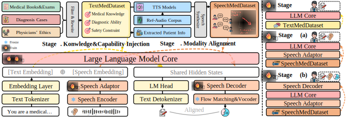

# SpeechMedAssist: Efficiently and Effectively Adapting Speech Language Model for Medical Consultation

> ⭐ Accepted by ACL 2026 Main Conference

SpeechMedAssist is a SpeechLM designed for speech-based multi-turn medical consultation, which can natively analyze symptoms, conduct proactive inquiries, and provide diagnostic and treatment suggestions.

[](https://arxiv.org/abs/2601.04638) 
[](https://github.com/SirryChen/SpeechMedAssist)
[](https://huggingface.co/SII-Sirry/SpeechMedAssist)
[](https://huggingface.co/datasets/SII-Sirry/SpeechMedDataset) 
[](https://mp.weixin.qq.com/s/2bx3dmaVIsT6cP6h4UzE4A)
[](https://speech.medassist.chat/)



---

## Demo for Preview
**👉 You can open [`online interactive demo`](https://speech.medassist.chat/) (maybe expired) or [online example](https://sirrychen.github.io/blogs/2025-09-22-SpeechMedAssist.html)** 

**👉 or you can download this repository and open [`index.html`](./demo_package/index.html) in your local browser to view the demo.**

**👉 One Sample Response from SpeechMedAssist**
- **SpeechMedAssist2 Text Response:**
> 📃处理方式要看具体情况，可能是药物治疗或者再次清宫。关键是早发现早治疗，避免感染和其他并发症。记得保持个人卫生，避免性生活直到医生说可以。

- **SpeechMedAssist2 Audio Response:**
> [**🔊click to play**](https://github.com/user-attachments/assets/aa7a38e9-14d1-4fab-ae18-391514076849)

---

## Quick Start for Inference
1. Prepare all the things
    ```shell
    git clone https://github.com/SirryChen/SpeechMedAssist.git
    cd SpeechMedAssist
    conda create -n sma python=3.10
    conda activate sma
    pip install -r requirements.txt
    wget https://openaipublic.azureedge.net/main/whisper/models/e5b1a55b89c1367dacf97e3e19bfd829a01529dbfdeefa8caeb59b3f1b81dadb/large-v3.pt -O ./weight/whisper/large-v3.pt
    hf download ICTNLP/cosy2_decoder --local-dir ./weight/cosy2_decoder
    hf download SII-Sirry/SpeechMedAssist --local-dir ./weight/stage3
    
    ```

2. Run an interactive demo in terminal
    ```shell
    cd inference
    python interact_SpeechMedAssist.py --s2s --model_path ../weight/stage3 --speech_decoder_path ../weight/cosy2_decoder 
    ```

---

## Go Through the Whole Project

### 0.Environment

To reproduce this work, the following steps are required:
```shell
conda create -n SpeechMedAssist python=3.10
pip install -r requirements.txt
```

To run all baselines in [[inference]](./inference), some functions in the original projects are needed. The following steps are required:
```shell
git clone https://github.com/zai-org/GLM-4-Voice.git ../GLM-4-Voice
git clone https://github.com/MoonshotAI/Kimi-Audio.git ../Kimi-Audio
git clone https://github.com/OpenMOSS/SpeechGPT-2.0-preview.git ../SpeechGPT-2.0-preview
conda create -n SpeechGPT2 python=3.10
pip install -r requirements_SpeechGPT2.txt
conda create -n KimiAudio python=3.10
pip install -r requirements_KimiAudio.txt
conda create -n shizhengpt python=3.10
pip install -r requirements_shizhengpt.txt
```


### 1.Download Data

[[Aishell2]](https://aishelltech.com/aishell_2)
[[Aishell3]](https://aishelltech.com/aishell_3)
[[Aishell-2018A-Eval]](https://aishelltech.com/aishell_2018_eval)
[[MedSafetyBench]](https://github.com/AI4LIFE-GROUP/med-safety-bench)

```shell
huggingface-cli download --resume-download FreedomIntelligence/HuatuoGPT2-SFT-GPT4-140K --repo-type dataset --local-dir ./dataset/HuatuoGPT2-SFT-GPT4-140K
huggingface-cli download --resume-download Suprit/CMtMedQA --repo-type dataset --local-dir ./dataset/CMtMedQA
huggingface-cli download --resume-download FreedomIntelligence/HuatuoGPT2-Pretraining-Instruction --repo-type dataset --local-dir ./dataset/HuatuoGPT2-Pretraining-Instruction 
huggingface-cli download --resume-download FreedomIntelligence/CMB --repo-type dataset --local-dir ./dataset/CMB
```


### 2.Download Weight
```shell
# base model
huggingface-cli download --resume-download ICTNLP/LLaMA-Omni2-7B-Bilingual --local-dir ./weight/LLaMA-Omni2-7B-Bilingual
huggingface-cli download --resume-download ICTNLP/cosy2_decoder --local-dir ./weight/cosy2_decoder
wget https://openaipublic.azureedge.net/main/whisper/models/e5b1a55b89c1367dacf97e3e19bfd829a01529dbfdeefa8caeb59b3f1b81dadb/large-v3.pt -O ./weight/whisper/large-v3.pt

git clone https://www.modelscope.cn/iic/CosyVoice2-0.5B.git ./weight/CosyVoice2-0.5B
git clone https://www.modelscope.cn/iic/CosyVoice-ttsfrd.git ./weight/CosyVoice-ttsfrd
cd ./weight/CosyVoice-ttsfrd/
unzip resource.zip -d .
pip install ttsfrd_dependency-0.1-py3-none-any.whl
pip install ttsfrd-0.4.2-cp310-cp310-linux_x86_64.whl 

# ASR & TTS for eval
huggingface-cli download --resume-download fishaudio/openaudio-s1-mini --local-dir ./weight/openaudio-s1-mini
huggingface-cli download --resume-download FunAudioLLM/SenseVoiceSmall --local-dir ./weight/SenseVoiceSmall

# Baseline
huggingface-cli download --resume-download moonshotai/Kimi-Audio-7B-Instruct --local-dir ./weight/Kimi-Audio-7B-Instruct
huggingface-cli download --resume-download FreedomIntelligence/ShizhenGPT-7B-Omni --local-dir ./weight/ShizhenGPT-7B-Omni
...
```

### 3.Predata

You can construct the dataset step by step by following the pipeline described in [`PREDATA.md`](./data/PREDATA.md). The process consists of four stages: **Filter**, **Rewrite**, **Get Patient Info**, and **Synthesize**.

Alternatively, you can skip the preprocessing steps and directly download the prepared dataset from Hugging Face:

```bash
hf download SII-Sirry/SpeechMedDataset --repo-type dataset --local-dir ./dataset/SpeechMedDataset
```

### 4.Train
Run the following command to train the model and get the final weight.

```shell
PYTHONPATH=../ nohup torchrun --nproc_per_node=THE_NUM_OF_GPU stage1.py > ../log/stage1.log 2>&1 &
PYTHONPATH=../ nohup torchrun --nproc_per_node=THE_NUM_OF_GPU stage2.py > ../log/stage2.log 2>&1 &
PYTHONPATH=../ nohup torchrun --nproc_per_node=THE_NUM_OF_GPU stage3.py > ../log/stage3.log 2>&1 &
```

Or you can download the weight from [`huggingface`](https://huggingface.co/SII-Sirry/SpeechMedAssist)  through
```bash
hf download SII-Sirry/SpeechMedAssist --local-dir ./weight/stage3
```


### 5.Eval

#### 5.1 Single-Turn Q&A
The eval code includes the following three parts: 
- [[CMB]](./eval/CMB/eval_CMB.py) 
- [[CMExam]](./eval/CMExam/eval_CMExam.py) 
- [[Med Safety]](./eval/MedSafety/eval_s2t.py)
- Ency: [[dialog record]](./eval/single_round/dialog_record.py) to record the conversation between the model and the patient, [[eval]](./eval/single_round/evaluation.py) for evaluation


#### 5.2 Multi-Turn Conversation

##### 5.2.1 First get the record of the conversation between the tested model as a doctor and the virtual patient through [`dialog_record.py`](./eval/conversation/dialog_record.py)

<details>
<summary>details of arguments and example command</summary>

| Argument               | Type | Option                                                                                   | Description                                                 |
|------------------------|------|------------------------------------------------------------------------------------------|-------------------------------------------------------------|
| `--test_model`         | str  | model like `"GLM4-Voice"`                                                                | The name of the model to test                               |
| `--patient_model_path` | str  | `"../../weight/Qwen2.5-72B-Instruct"`                                                    | Path to the patient model, here we use Qwen2.5-72B-Instruct |
| `--base_info_path`     | str  | `../../dataset/MedDG/MedDG-sharegpt-test.json`, `../../dataset/AIHospital/patients.json` | Path to the patient info JSON file.                         |
| `--ref_wav_path`       | str  | `"../../dataset/ref_audio/Aishell-2018A-EVAL/spk_info.json"`                             | Path to reference audio (for speech synthesis)              |
| `--max_turns`          | int  | `6`                                                                                      | Maximum number of dialogue turns per conversation           |
| `--input_speech`       | bool | `True/False`                                                                             | Whether to use speech input                                 |
| `--output_speech`      | bool | `True/False`                                                                             | Whether to generate speech output for doctor model          |
| `--patient_profile`    | str  | `MedDG`, `AIHospital`                                                                    | Patient profile type.                                       |
| `--log_level`          | str  | `DEBUG`, `INFO`, `WARNING`, `ERROR`, `CRITICAL`                                          | Logging level.                                              |


```bash
python dialog_record.py \
  --test_model Zhongjing \
  --patient_model_path ../../weight/Qwen2.5-72B-Instruct \
  --base_info_path ../../dataset/AIHospital/patients.json \
  --ref_wav_path ../../dataset/ref_audio/Aishell-2018A-EVAL/spk_info.json \
  --max_turns 6 \
  --input_speech True \
  --output_speech True \
  --patient_profile AIHospital \
  --log_level INFO \
  2>&1 | tee -a record_s2t.log

```

</details>

##### 5.2.2 Then evaluate the performance of the tested model through [`evaluation.py`](./eval/conversation/evaluation.py)

<details open>
<summary>example command</summary>

```bash
python evaluation.py \
  --eval_mode single \
  --model_a SpeechMedAssist2-audio-only-wo-assistant \
  --patient_profile MedDG \
  --mode s2t \
  2>&1 | tee -a eval_s2t.log

```
</details>

#### 5.3 Wild

Almost the same as the single-turn Q&A.


## Code Usage
- [LLaMA-Omni2](https://github.com/ictnlp/LLaMA-Omni2): Our model is built upon LLaMA-Omni2. We utilize its publicly available implementation for the core model code and have extended it with additional training modules.

If our work is useful for you, please cite as:

```
@article{chen2026speechmedassist,
  title={SpeechMedAssist: Efficiently and Effectively Adapting Speech Language Models for Medical Consultation},
  author={Chen, Sirry and Wang, Jieyi and Chen, Wei and Wei, Zhongyu},
  journal={arXiv preprint arXiv:2601.04638},
  year={2026}
}
```

